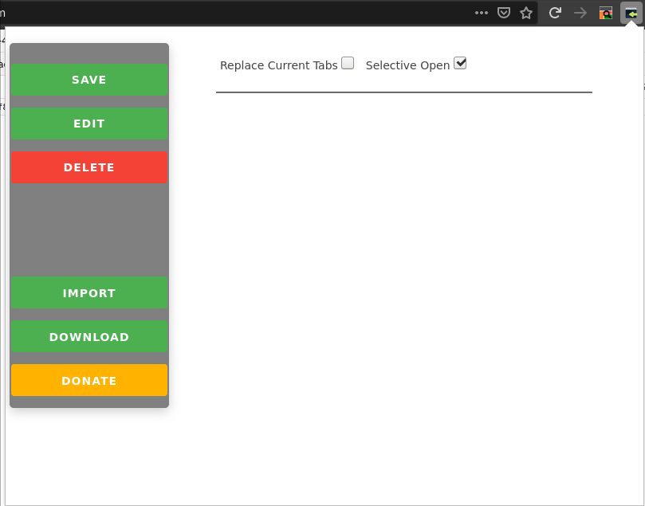
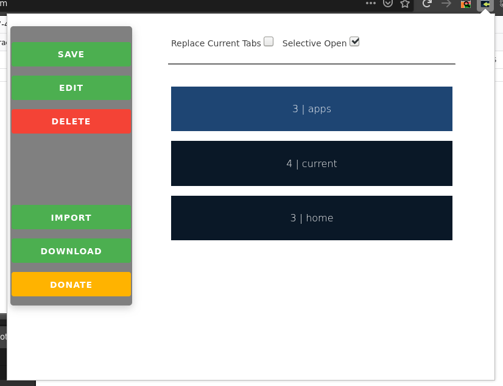
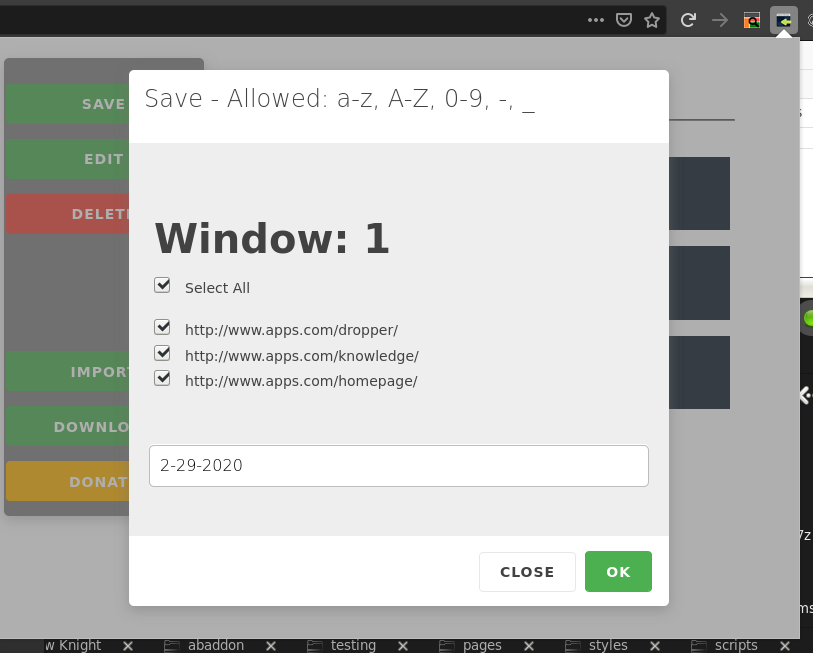
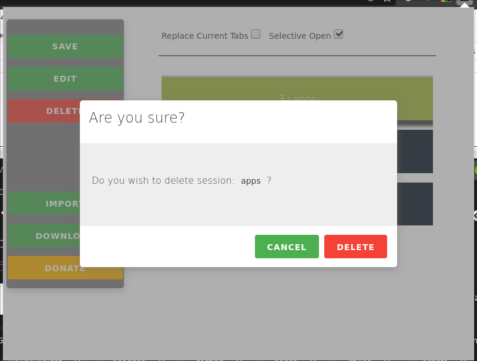
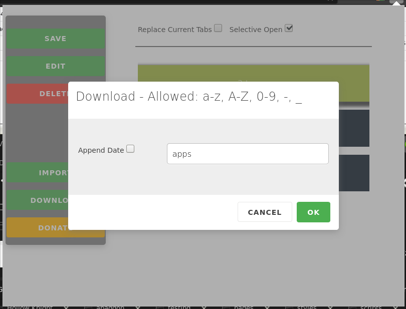

# Easy Session Manager
Easy Session Manager allows you to manage your Firefox session by backing up or loading your saved sessions.

# Download
https://addons.mozilla.org/en-US/firefox/addon/easy-session-manager/

# Version: 0.2.0
Added additional edit functionality.
Added selective save functionality.

# Images

